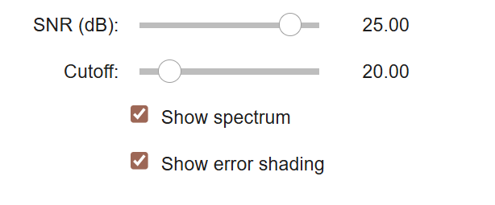
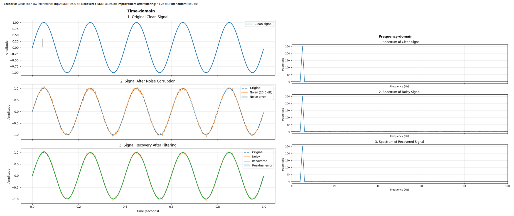
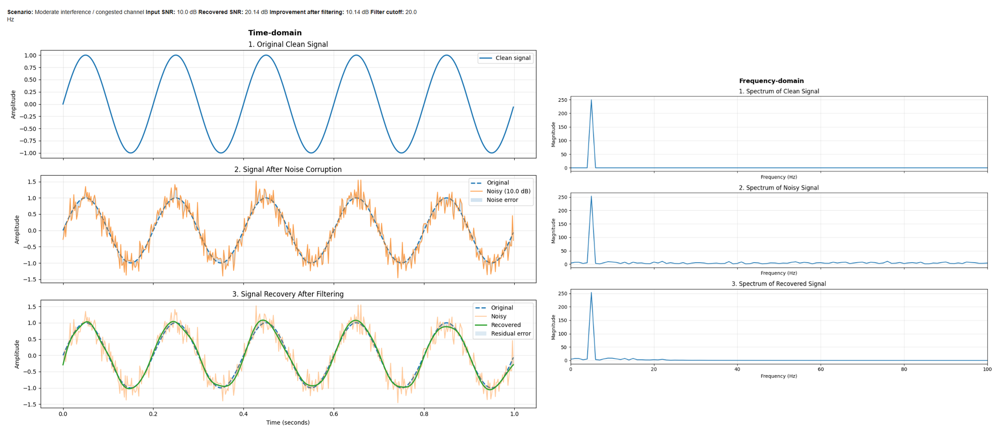
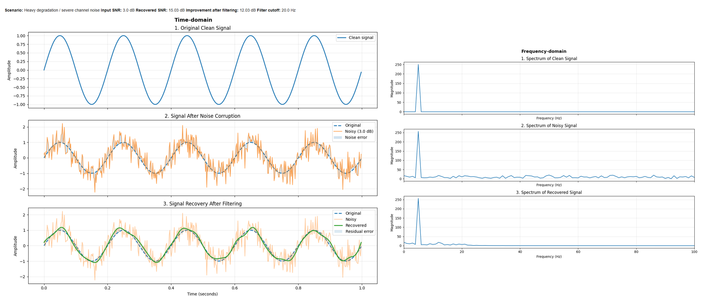

# 📡 Signal & Noise Simulator

[](https://colab.research.google.com/github/Eyimofe-y/signal-noise-simulator/blob/main/Signal_and_Noise_Simulator.ipynb)
[](https://python.org)
[]()

---

## 📖 Overview

This project visualizes Claude Shannon's probabilistic model of communication. It simulates how a signal travels through a noisy channel, like a rainstorm or electromagnetic interference, and demonstrates the mathematical limits of signal recovery.

---

## 🧐 Why This Exists

Communication systems (phones, satellites, deep-space probes) fight a fundamental battle: transmitting data through a channel that is actively trying to corrupt it.

This simulator moves beyond the textbook to let you:
- **See** what noise does to a signal
- **Watch** a filter try to remove it
- **Measure** exactly how much was recovered using real-world physics
- **Choose** which SNR Level you would want to visualize using an interactable slider



---

## 🧠 The Simulation Workflow

The code follows Shannon's 5-step model:

```
[Source] → [Transmitter] → [Noisy Channel] → [Receiver] → [Destination]
  sine        encode         add Gaussian      Butterworth    measure
  wave        signal         noise (SNR)       filter         recovery (dB)
```

1. **Source** — Generates a clean x Hz sine wave
2. **Transmitter** — Encodes the signal for the channel
3. **Noisy Channel** — Adds Gaussian noise based on specific SNR levels
4. **Receiver** — Applies a Butterworth low-pass filter to attempt recovery
5. **Destination** — Measures residual noise and recovery quality in decibels

---

## 📊 Results & Visualisation

The simulator compares performance across three scenarios:

| SNR Level | Real-World Context | Expected Outcome |
|-----------|--------------------|-----------------|
| 25 dB and above | Clear night, strong signal | Near-perfect recovery |
| 11 - 25 dB | Peak hours, moderate interference | Visible jitter, successful filtering |
| 0 -10 dB | Heavy rainstorm (Lagos / Port Harcourt) | Physics-limited recovery — signal overlaps noise |

### Low Interference simulation


### Moderate Interference simulation


### High Interference simulation


---

## 🛠️ Tech Stack

| Library | Role |
|---------|------|
| `NumPy` | Signal generation and power calculations |
| `SciPy` | Butterworth filter design via `signal.filtfilt` |
| `Matplotlib` | Data visualisation and plotting |
| `ipywidgets ` | UI elements (buttons, sliders, dropdowns) |
| `IPython.display` | Manages how results show up on the screen |

---

## 🚀 Getting Started

### Option 1 — Google Colab (zero setup)

Click the **Open in Colab** badge at the top of this README to run the simulation in your browser instantly.

### Option 2 — Local installation

```bash
# 1. Clone the repository
git clone https://github.com/YOUR_USERNAME/signal-noise-simulator
cd signal-noise-simulator

# 2. Install dependencies
pip install numpy scipy matplotlib jupyter

# 3. Launch the notebook
jupyter notebook signal_noise_simulator.ipynb
```

---

## 💭 Key Learnings

The most surprising result? At **3dB SNR**, recovery hits a hard ceiling and no amount of filter tuning can break through it. You can check it out using the simulator!

This is not a bug. It's **Channel Capacity**.

Shannon proved that once noise overlaps the signal's own frequency range, no engineering can perfectly separate them. This is the mathematical reality behind why your satellite internet drops during a tropical thunderstorm in some countries (e.g. Nigeria) — not a network management failure but a physics one.

---

## 📝 License

Distributed under the MIT License. See `LICENSE` for more information.

---

## 🤝 Connect

[](https://linkedin.com/in/oluwaferanmi-yesufu-164b72222)

*Built by someone who got tired of asking "why does it do that?" and started simulating it instead.*
