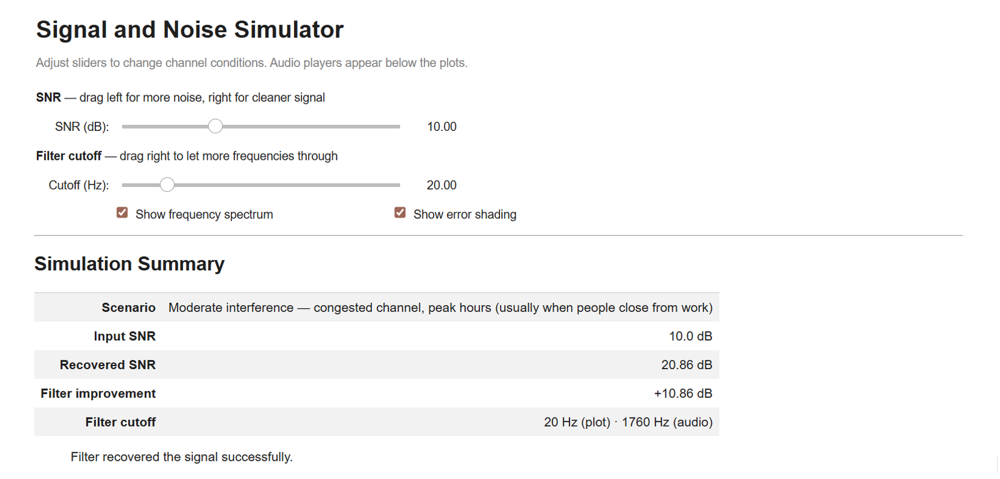
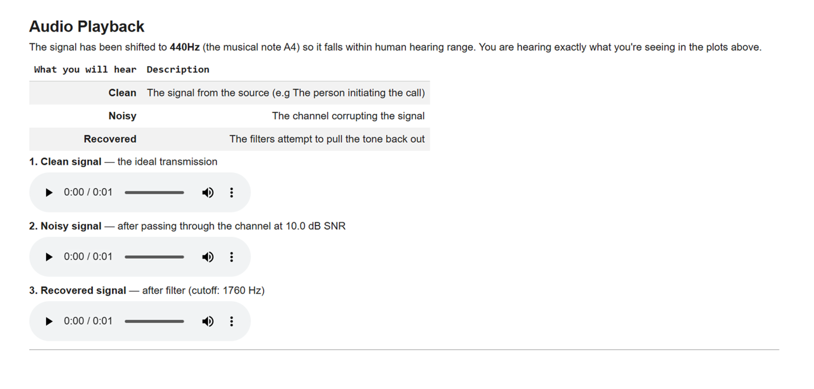
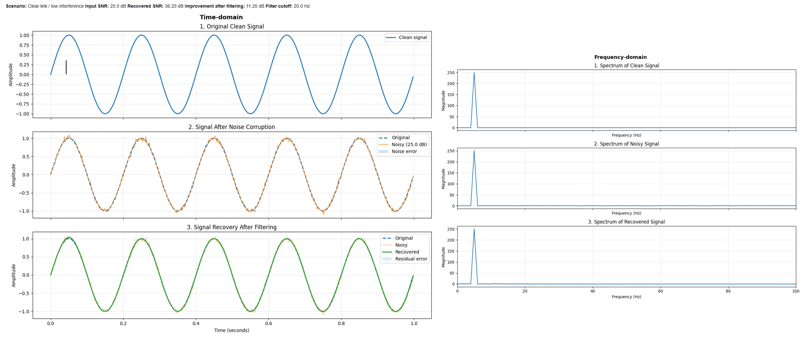
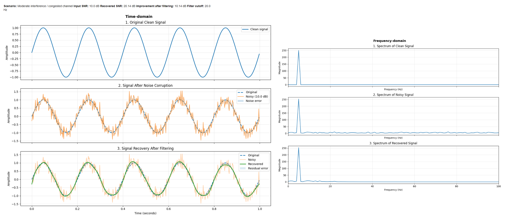
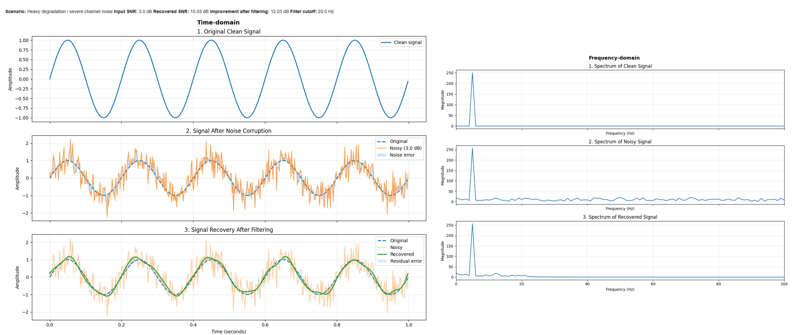

# Signal and Noise Simulator (with audio)

[](https://colab.research.google.com/github/Eyimofe-y/signal-noise-simulator/blob/main/signal_noise_simulator_w_audio.ipynb)
[](https://python.org)

---

## Overview

This project visualizes Claude Shannon's probabilistic model of communication. It simulates how a signal travels through a noisy channel both visually and with audio, like a rainstorm or electromagnetic interference, and demonstrates the mathematical limits of signal recovery.

---

## Why This Exists

Communication systems (phones, satellites, deep-space probes) fight a fundamental battle: transmitting data through a channel that is actively trying to corrupt it.

This simulator moves beyond the textbook to let you:
- **See** what noise does to a signal
- **Watch** a filter try to remove it
- **Measure** exactly how much was recovered using real-world physics
- **Choose** which SNR Level you would want to visualize and hear using an interactable slider and audio player

#### Interactable slider


#### Audio player

---

## The Simulation Workflow

The code follows Shannon's 5-step model:

```
[Source] → [Transmitter] → [Noisy Channel] → [Receiver] → [Destination]
  sine        encode         add Gaussian      Butterworth    measure
  wave        signal         noise (SNR)       filter         recovery (dB)
```

---

## Results & Visualisation

The simulator compares performance across three scenarios:

| SNR Level | Real-World Context | Expected Outcome |
|-----------|--------------------|-----------------|
| 25 dB and above | Clear night, strong signal | Near-perfect recovery |
| 11 - 25 dB | Peak hours, moderate interference | Visible jitter, successful filtering |
| 0 -10 dB | Heavy rainstorm (Lagos / Port Harcourt) | Physics-limited recovery — signal overlaps noise |

### Low Interference simulation


### Moderate Interference simulation


### High Interference simulation



---

## Run it

### Option 1 — Google Colab (zero setup)

Click the **Open in Colab** badge at the top of this README to run the simulation in your browser instantly.

### Option 2 — Local installation

```bash
# 1. Clone the repository

# 2. Install dependencies
pip install numpy scipy matplotlib jupyter

# 3. Launch the notebook
jupyter notebook signal_noise_simulator.ipynb
```

---

## Key Learnings

The most surprising result? At **3dB SNR**, recovery hits a hard ceiling and no amount of filter tuning can break through it. You can check it out using the simulator and also hear it!

This is not a bug. It's **Channel Capacity**.

Shannon proved that once noise overlaps the signal's own frequency range, no engineering can perfectly separate them. This is the mathematical reality behind why your internet drops during rain and thunderstorm in some countries (e.g. Nigeria), it is not a network management failure but a physics one.

---

## License

Distributed under the MIT License. See `LICENSE` for more information.

---

## 🤝 Connect

[](https://linkedin.com/in/oluwaferanmi-yesufu-164b72222)
